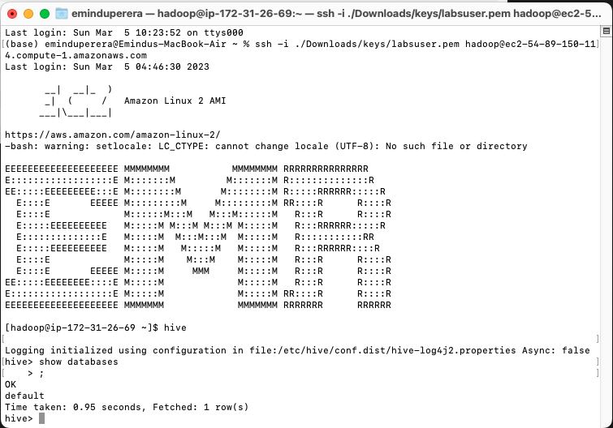

# aws_emr_hive_spark

1. connecting to emr cluster though ssh
```
ssh -i ~/vockey.pem <>.amazonaws.com
```




### Attribute names and data type of input csv


|     Column          | Non-Null Count | Dtype   |
|---------------------|----------------|---------|
| Unnamed: 0          | 1000           | int64   |
| Year                | 1000           | int64   |
| Month               | 1000           | int64   |
| DayofMonth          | 1000           | int64   |
| DayOfWeek           | 1000           | int64   |
| DepTime             | 1000           | int64   |
| CRSDepTime          | 1000           | int64   |
| ArrTime             | 990            | float64 |
| CRSArrTime          | 1000           | int64   |
| UniqueCarrier       | 1000           | object  |
| FlightNum           | 1000           | int64   |
| TailNum             | 1000           | object  |
| ActualElapsedTime   | 990            | float64 |
| CRSElapsedTime      | 1000           | int64   |
| AirTime             | 990            | float64 |
| ArrDelay            | 990            | float64 |
| DepDelay            | 1000           | int64   |
| Origin              | 1000           | object  |
| Dest                | 1000           | object  |
| Distance            | 1000           | int64   |
| TaxiIn              | 990            | float64 |
| TaxiOut             | 1000           | int64   |
| Cancelled           | 1000           | int64   |
| CancellationCode    | 1000           | object  |
| Diverted            | 1000           | int64   |
| CarrierDelay        | 760            | float64 |
| WeatherDelay        | 760            | float64 |
| NASDelay            | 760            | float64 |
| SecurityDelay       | 760            | float64 |
| LateAircraftDelay   | 760            | float64 |


### hive sql table create command to create table for matching above data

```
CREATE EXTERNAL TABLE IF NOT EXISTS delayedFlights(
  Year int, 
  Month int,
  DayofMonth int,
  DayOfWeek int,
  DepTime int,
  CRSDepTime int,
  ArrTime int,
  CRSArrTime int,
  UniqueCarrier string,
  FlightNum int,
  TailNum string,
  ActualElapsedTime int,
  CRSElapsedTime int,
  AirTime int,
  ArrDelay int,
  DepDelay int,
  Origin string,
  Dest string,
  Distance int,
  TaxiIn int,
  TaxiOut int,
  Cancelled string,
  CancellationCode string,
  Diverted string,
  CarrierDelay int,
  WeatherDelay int,
  NASDelay int,
  SecurityDelay int,
  LateAircraftDelay int
)
ROW FORMAT DELIMITED 
FIELDS TERMINATED BY ',' 
LOCATION '/user/tables/delayedFlights';

```

### loading data
```
LOAD DATA INPATH '<s3 bucket link>' OVERWRITE INTO TABLE delayedFlights;
```


### The airlines market has been faced losses due to the flight delay and there are many reasons for delaying a flight. In this Analysis, you need to analyse the various delay happens in airlines per year and run the queries as follows.
1. Year wise carrier delay from 2003-2010
```
SELECT Year As Year, SUM(CarrierDelay) As TotalCarrierDelay
FROM delayedFlights
WHERE Year BETWEEN 2003 AND  2010
GROUP BY Year
ORDER BY Year;
```


2. Year wise NAS delay from 2003-2010
```
SELECT Year As Year, SUM(NASDelay) AS TotalNASDelay
FROM delayedFlights
WHERE Year BETWEEN 2003 AND 2010
GROUP BY Year
ORDER BY Year;
```
3. Year wise Weather delay from 2003-2010
```
SELECT Year As Year, SUM(WeatherDelay) AS TotalWeatherDelay
FROM delayedFlights
WHERE Year BETWEEN 2003 AND 2010
GROUP BY Year
ORDER BY Year;
```
4. Year wise late aircraft delay from 2003-2010

```
SELECT Year As Year, SUM(LateAircraftDelay) AS LateAircraftDelay
FROM delayedFlights
WHERE Year BETWEEN 2003 AND  2010
GROUP BY Year
ORDER BY Year;
```

5. Year wise security delay from 2003-2010
```
SELECT Year As Year, SUM(SecurityDelay) AS SecurityDelay
FROM delayedFlights
WHERE Year BETWEEN 2003 AND  2010
GROUP BY Year
ORDER BY Year;

```